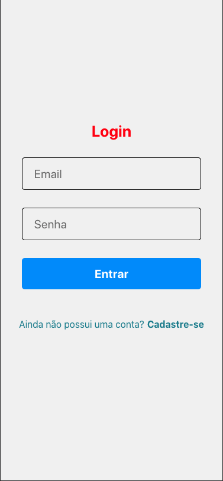
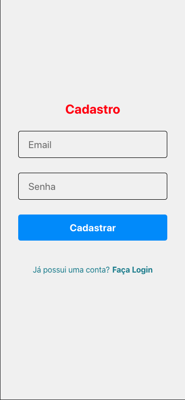

## 💻 Sobre o projeto

Projeto para se familiarizar com o React-native, React-navigation (V5).

---

## 🎨 Layout

### Mobile

<p align="center">
  

  
</p>

---

## 🚀 Como executar o projeto

### Pré-requisitos

Antes de começar, você vai precisar ter instalado em sua máquina as seguintes ferramentas:
[Git](https://git-scm.com), [Node.js](https://nodejs.org/en/). 
Além disto é bom ter um editor para trabalhar com o código como [VSCode](https://code.visualstudio.com/)

#### Rodando a aplicação web (Frontend)

```bash

# Clone este repositório
$ git clone https://github.com/YukioVN/project-rn.git

# Acesse a pasta do projeto no seu terminal/cmd
$ cd PROJECT-RN

# Instale as dependências
$ yarn install

# Execute a aplicação em modo de desenvolvimento
$ yarn web

```

---

## 🛠 Tecnologias

As seguintes ferramentas foram usadas na construção do projeto:

#### **Mobile**  ([React Native](http://www.reactnative.com/))

-   **[Expo](https://expo.io/)**
-   **[React Navigation](https://reactnavigation.org/)**
-   **[Axios](https://github.com/axios/axios)**
-   **[Styled-components](https://github.com/styled-components/styled-components)**

> Veja o arquivo  [package.json](https://github.com/YukioVN/project-rn/blob/main/package.json)
